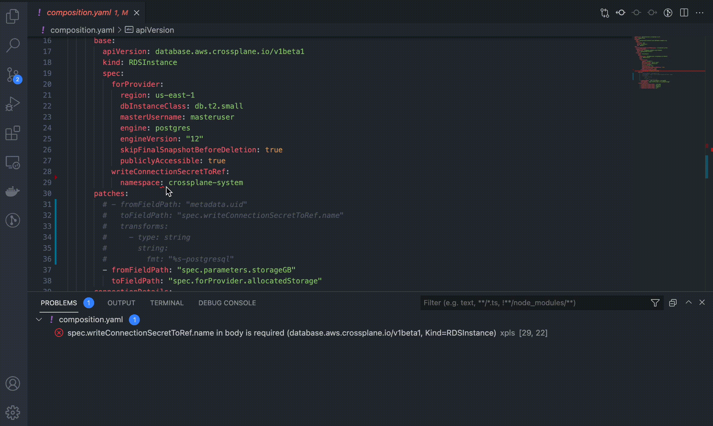

# Crossplane package support for Visual Studio Code

## Getting Started

Welcome! 👋🏻 
Whether you are new to Crossplane package authoring or an experienced Crossplane 
operator, we hope this extension enhances your development experience.

* **Step 1.** If you haven't done so already, install the latest version of [Up]
  and the [VS Code Up extension].
  * [Managing extensions in VS Code].
* **Step 2.** To activate the extension, open any directory or workspace
  containing a Crossplane package (i.e. one that contains a `crossplane.yaml`).

## Features
This extension currently provides diagnostics as you work, through its integation 
with [`xpls`]. You can see overviews of the various features currently available
below:

 
<em>(crossplane.yaml dependency version validation)</em>

 
<em>(crossplane.yaml dependency type validation)</em>

 
<em>(crossplane.yaml dependency missing validation)</em>

 
<em>(XRC schema validation)</em>

 
<em>(Composed resource schema validation)</em>

 
<em>(Composed resource schema validation with patched details)</em>

 
<em>(XRD openAPIv3Schema validation)</em>

## Ask for help
If you run into a problem please reach out to us
by [filing an issue],
[starting a GitHub discussion],
or by asking a question on [Slack]

## Contributing
See [CONTRIBUTING.md]

## License
[Apache 2.0 license](LICENSE)

<!-- Named Links -->
[CONTRIBUTING.md]: CONTRIBUTING.md
[filing an issue]: https://github.com/upbound/vscode-up/issues/new/choose
[starting a GitHub discussion]: https://github.com/upbound/vscode-up/discussions
[LICENSE]: LICENSE
[Managing extensions in VS Code]: https://code.visualstudio.com/docs/editor/extension-gallery
[Slack]: https://crossplane.slack.com/messages/upbound/
[Up]: https://github.com/upbound/up
[VS Code Up extension]: https://marketplace.visualstudio.com/items?itemName=Upboundio.upbound
[`xpls`]: https://github.com/upbound/up